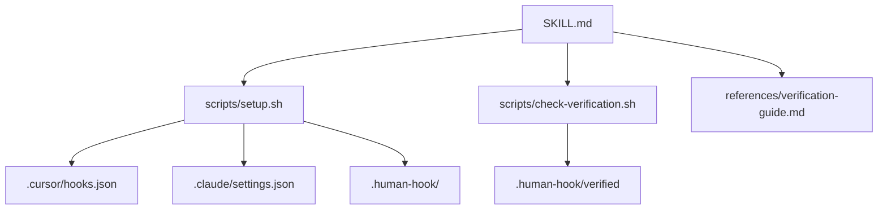

# Implement Human Hook v1

All deliverables live at the repo root as a skill package, following the directory structure from the [technical spec](docs/technical-spec.md#2-directory-structure).

## Deliverables

## Implementation Order

### 1. Hook script -- `scripts/check-verification.sh`

The core gate. A bash script that:

- Reads JSON from stdin (compatible with both Cursor and Claude Code input formats)
- Extracts the shell command from the JSON payload
- Checks if it matches configured triggers (default: `git push`)
- Checks for `HUMAN_HOOK_OVERRIDE` env var
- Computes SHA-256 of outgoing diff (`git diff @{upstream}..HEAD`, falling back to `git diff main..HEAD` for new branches)
- Compares against `.human-hook/verified`
- Exits 0 (allow) or exits 2 with deny JSON (block)

Key detail: the JSON input format differs between Cursor (`{ "command": "..." }`) and Claude Code (`{ "tool_input": "..." }`). The script should handle both by checking which field is present. The deny response must include `agent_message` text that directs the agent to run the verification skill.

Dependencies: `jq` for JSON parsing, `shasum` for hashing. Both are standard on macOS/Linux.

### 2. Setup script -- `scripts/setup.sh`

Run once by the skill on first use. Must:

- Detect Cursor (`.cursor/` exists) and/or Claude Code (`.claude/` exists)
- For Cursor: read `.cursor/hooks.json`, merge in the `beforeShellExecution` hook entry, write back. Handle missing file, existing file without conflicts, and idempotent re-runs.
- For Claude Code: read `.claude/settings.json`, merge in the `PreToolUse` hook entry, write back. Same merge logic.
- Copy `check-verification.sh` to `.human-hook/hooks/` and make executable
- Create `.human-hook/config.json` with defaults (triggers: `["push"]`, trivial thresholds, override var)
- Append `.human-hook/verified` to `.gitignore` if not already present

The merge logic uses `jq` to non-destructively insert the hook entry into existing arrays.

### 3. Example config -- `.human-hook.config.example.json`

A reference copy of the default config from [tech spec section 7](docs/technical-spec.md#7-project-configuration). Committed to the repo so users can see what's configurable.

### 4. Verification guide -- `references/verification-guide.md`

Detailed reference for the agent on how to evaluate understanding. Covers:

- What good answers look like for each question category (architectural intent, integration awareness, trade-off consciousness)
- Examples of passing vs. failing responses
- How to handle edge cases (developer honestly says "I don't know", very small changes, refactoring-only changes)
- Tone guidance (collaborative, not adversarial)

Kept as a reference file so SKILL.md stays lean -- the agent loads this only during active verification.

### 5. SKILL.md

The main skill file. Frontmatter with `name: human-hook` and a description targeting triggers like "commit", "push", "verify understanding", "human hook".

Body covers:

- **First-use setup**: Check if `.human-hook/hooks/check-verification.sh` exists. If not, run `scripts/setup.sh`.
- **Verification workflow**: The 5-phase flow from [tech spec section 3](docs/technical-spec.md#verification-conversation-design) -- diff analysis, question generation, conversation, evaluation, outcome.
- **Trivial change detection**: Rules for skipping verification.
- **Receipt writing**: `git diff @{upstream}..HEAD | shasum -a 256 | awk '{print $1}' > .human-hook/verified`
- **Override acknowledgment**: If the developer requests an override, set `HUMAN_HOOK_OVERRIDE=1` and note that verification was skipped.
- Reference to `references/verification-guide.md` for detailed evaluation criteria.

Must stay under 500 lines per skill best practices.

### 6. Test the full flow manually

- Run `setup.sh` in the repo to install hooks
- Stage and commit some changes
- Attempt `git push` and verify the hook blocks
- Manually create a receipt and verify the hook allows
- Test the override env var
- Test with an empty diff (nothing to push)
